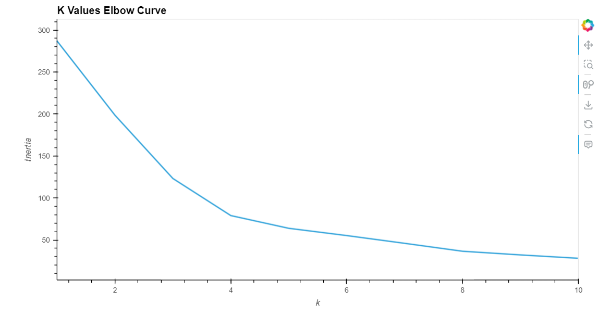
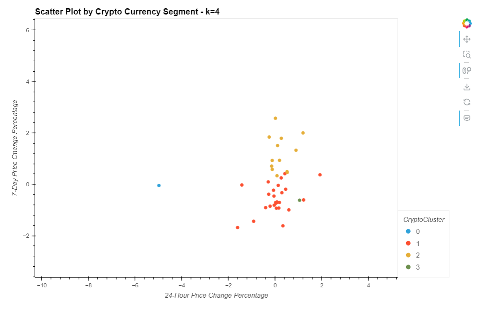
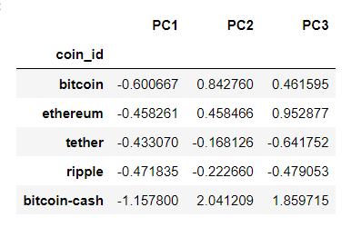
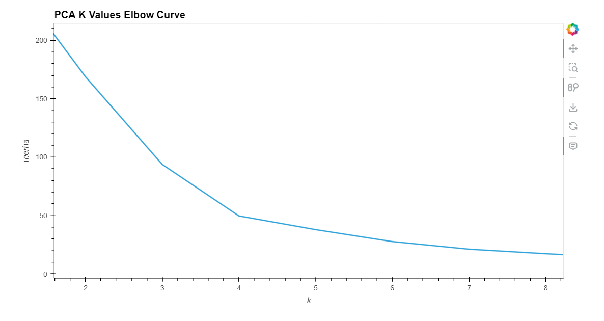
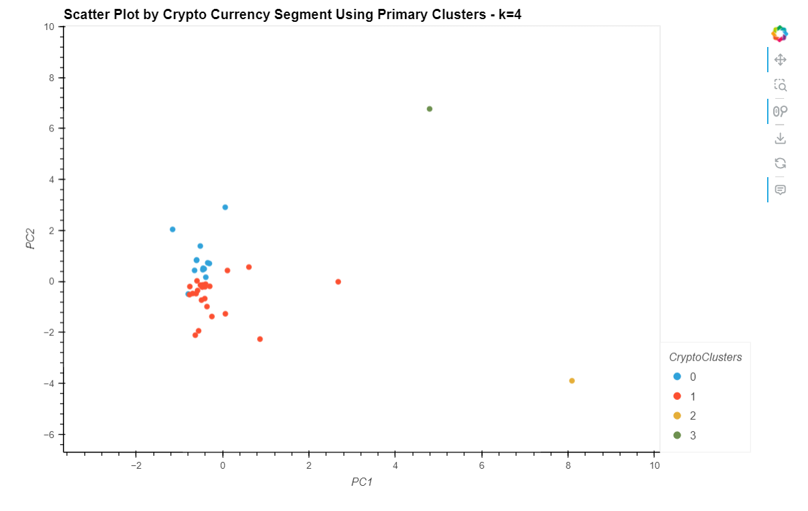

# Module 19 Challenge: Unsupervised Learning - CryptoClustering 
In this challenge we are asked to apply the unsupervised learning technique of K-Means clustering to group cryptocurrencies by their performance in an effort to create profitable portfolio recommendations.

## Data Used
[crypto_market_data.csv](Resources/crypto_market_data.csv) - market data of different cryptocurrencies during different time periods

## Overview of the Assignment
We start by using the elbow curve method, using normalized data, to find the optimal k value for the K-Means model that will use all of the original features of the dataset. 

Then, using the optimal k value we train and predict the K-Means model to generate 4 clusters of cryptocurrencies. The inertia of each cluster was significant enough to consider reducing the amount of features. 

To reduce the amount of features used, we apply Principal Component Analysis to create 3 primary clusters.

We then used the PCA data to again calculate the optimal k value for the K-Means model. 

Finally, with the optimal k value for the PCA features, we plot the new clusters. 

## Technologies
This challenge uses Python code that runs using a JupyterLab in a conda dev environment.
The following dependencies are used:
1. Jupyter - Running code
2. Conda - Dev environment
3. Pandas - Data analysis
4. Matplotlib - Data visualization
5. Numpy - Data calculations + Pandas support
6. hvPlot - Interactive Pandas plots
7. scikit-learn - KMeans clustering, data normalization, and PCA
8. warnings - To filter out warning messages
      
## How to execute code?
- If you would like to run the program in JupyterLab, install the [Anaconda](https://www.anaconda.com/download) distribution and run jupyter lab in a conda dev environment.

- To ensure that your notebook runs properly you can use the [requirements.txt](Resources/requirements.txt) file to create an exact copy of the conda dev environment used in development of this challenge.

- Create a copy of the conda dev environment with conda create --name myenv --file requirements.txt

- Then install the requirements with conda install --name myenv --file requirements.txt

- The Jupyter notebook [Crypto_Clustering.ipynb](Crypto_Clustering.ipynb) provides all steps of the data collection, preparation, and analysis. Data visualizations are shown inline and accompanying analysis responses are present in markdown cells in the same notebook.

